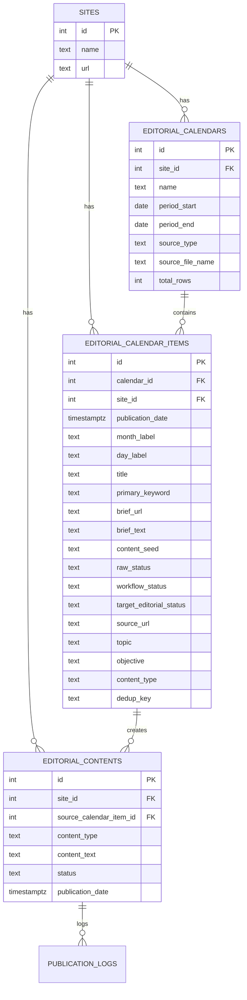

# WebSEO Platform

Application SEO + calendrier éditorial avec génération IA, publication sociale et maintenant une couche de **planning éditorial structuré** (import CSV/Sheet).

## Fonctionnalités principales
- Analyse SEO et GEO
- Calendrier éditorial (contenus à publier)
- Génération IA de calendrier + rédaction
- Publication sociale
- Planning éditorial importable depuis CSV (nouveau)

## Stack
- Frontend: React + TypeScript + Tailwind + TanStack Query
- Backend: Express + TypeScript
- Database: Supabase Postgres

## Installation
```bash
npm install
npm run dev
```

Application sur `http://localhost:5000`.

## Migration Planning (obligatoire)
Appliquer la migration SQL suivante dans Supabase SQL Editor:

- [`supabase/migrations/010_add_editorial_planning.sql`](/c:/Users/Hopi/.gemini/antigravity/webseo/supabase/migrations/010_add_editorial_planning.sql)

## Nouveau menu Planning
Route: `/planning`

Permet de:
1. importer un CSV (preview + import),
2. filtrer les lignes (mois, statut, calendrier, recherche),
3. pousser une ligne vers `editorial_contents` avec “Créer contenu”.

## Architecture de données


## Architecture applicative (flux)
```mermaid
flowchart LR
  A[UI Planning CSV] --> B[/api/planning/import]
  B --> C[(editorial_calendars)]
  B --> D[(editorial_calendar_items)]
  D --> E[UI Planning Table]
  E --> F[/api/planning/items/:id/create-content]
  F --> G[(editorial_contents)]
  G --> H[Calendrier éditorial]
  G --> I[Publication sociale]
```

## API Planning (nouvelle)
- `GET /api/planning/calendars?siteId=:id`
- `GET /api/planning/items?siteId=:id&calendarId=&month=&workflowStatus=&search=`
- `POST /api/planning/import` (multipart form-data: `file`, `siteId`, `year`, `dryRun`, `calendarName`)
- `POST /api/planning/items/:id/create-content`

## Notes mapping CSV
- `Contenu` alimente `content_seed`
- `Titre` alimente `title`
- `Mot-clé principal`, `Brief`, `URL brief Semrank`, `URL` sont stockés en champs dédiés
- `Status` du CSV est conservé (`raw_status`) + normalisé (`workflow_status`) + mappé vers statut éditorial (`target_editorial_status`)
